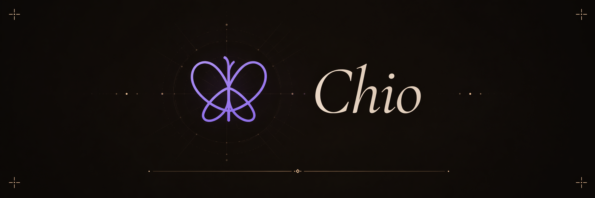

  

# Chio

Chio is a universal security kernel for the agent economy. It turns software agents into first-class economic actors with verifiable identity, scoped authority, capped budgets, and a cryptographic receipt on every action. A single fail-closed Rust kernel enforces it all, across every protocol, every language, and every organization. It will be open source soon and we're looking for design partners, underwriters, and contributors to help build it. connor@backbay.io
